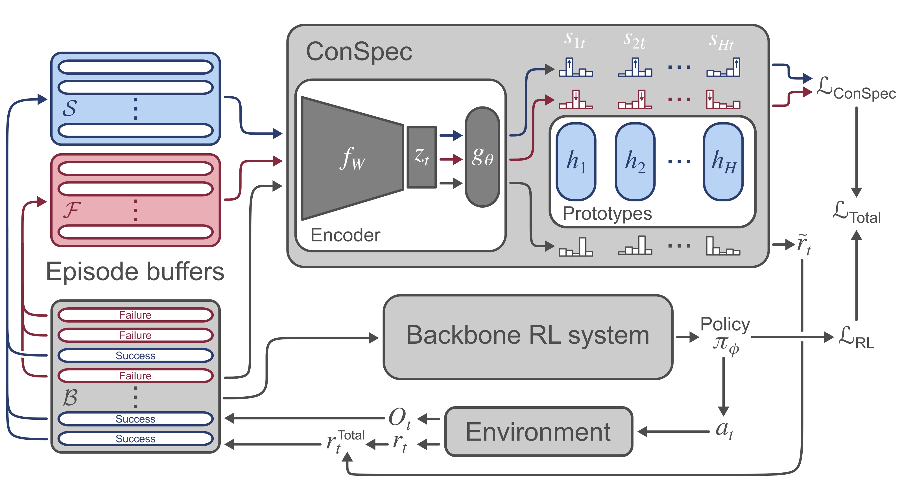
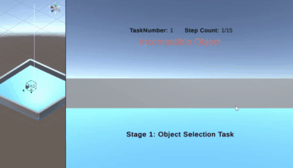

# Contrastive Introspection (ConSpec) 

### Chen Sun, Wannan Yang, Benjamin Alsbury-Nealy, Yoshua Bengio, Blake Richards 2022

This repository implements contrastive introspection (ConSpec) as detailed in the paper: 

There are 3 subfolders. One implements ConSpec with a PPO backbone in multi-door-to-key tasks. Another implements ConSpec in the OrangeTree task described in the paper.
The third implements ConSpec as a function that can be added onto any RL agent of choice, for interested researchers. 

# 
# 
